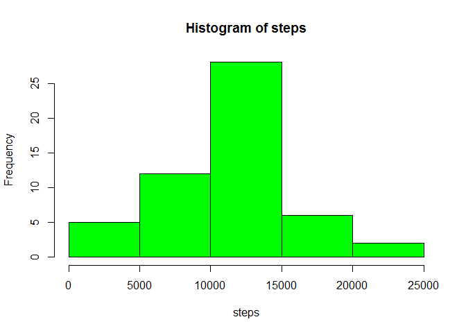
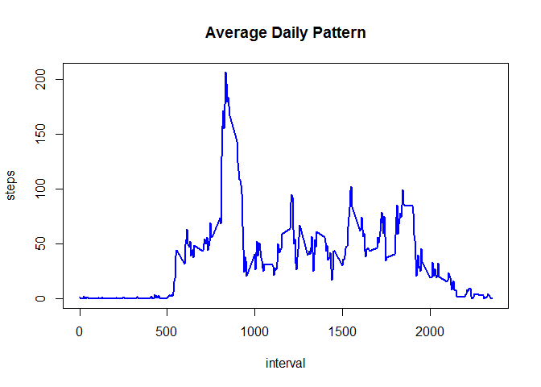
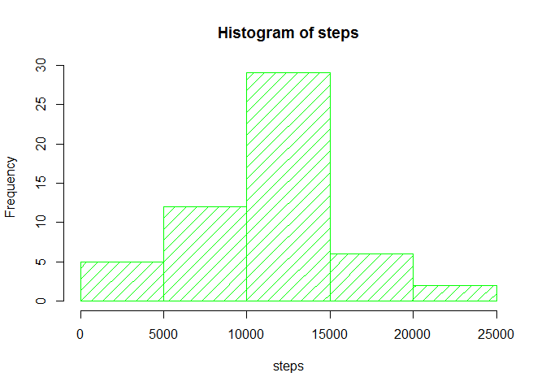
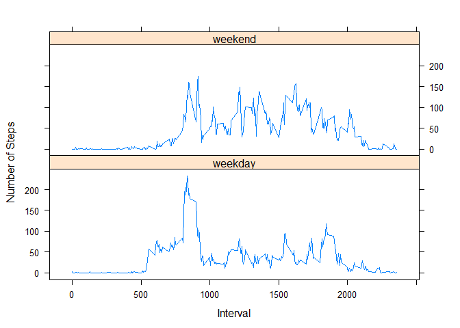

# Reproducible Research: Peer Assessment 1
wu-albert  
July 25, 2016  


## Loading and preprocessing the data
1. Load the data (i.e. `read.csv()`)

Download and unzip the data as a csv file

The variables included in this dataset are:

* **steps**: Number of steps taking in a 5-minute interval (missing values are coded as NA ) 
* **date**: The date on which the measurement was taken in YYYY-MM-DD format 
* **interval**: Identifier for the 5-minute interval in which measurement was taken

```r
filename <- "activity.zip"
if (!file.exists(filename)){
  fileURL <- "https://github.com/rdpeng/RepData_PeerAssessment1/raw/master/activity.zip"
  download.file(fileURL, filename)
}  
if (!file.exists("activity")) { 
  unzip(filename) 
}
```
Sum the data by each date:

```r
activity<-read.csv("activity.csv")
actbydate<-aggregate(steps~date, data=activity, FUN=sum)
```


## What is mean total number of steps taken per day?
1. Make a histogram of the total number of steps taken each day

```r
par(mfrow=c(1,1))
with(actbydate, hist(steps, col = "green"))
```

<!-- -->

2. Calculate and report the **mean** and **median** total number of steps taken per day

```r
mean(actbydate$steps, na.rm = T)
```

```
## [1] 10766.19
```

```r
median(actbydate$steps, na.rm = T)
```

```
## [1] 10765
```


## What is the average daily activity pattern?
1. Time series plot of the 5-minute interval (x-axis) and the average number of steps taken, averaged across all days (y-axis)

```r
actbymin<-aggregate(steps~interval, data=activity, FUN=mean)
with(actbymin, plot(x=interval, y=steps, type="l",  main ="Average Daily Pattern", lwd=2, col="blue"))
```

<!-- -->

2. Which 5-minute interval, on average across all the days in the dataset, contains the maximum number of steps?

```r
index<-which(  max(actbymin$steps)==actbymin$steps  )
actbymin$interval[index]
```

```
## [1] 835
```
## Imputing missing values
1. Calculate and report the total number of missing values in the dataset (i.e. the total number of rows with `NA`s)

```r
sum(is.na(activity))
```

```
## [1] 2304
```
2. Devise a strategy for filling in all of the missing values in the dataset. The strategy does not need to be sophisticated.

`NA` values will be replaced with the overall mean for that 5-minute interval

3. Create a new dataset that is equal to the original dataset but with the missing data filled in

```r
## Determine the indexes with NA values
j<-which(is.na(activity$steps))
## Create a vector with the values to insert into the original dataset
replacement<- actbymin$steps[  which(   activity$interval[j] 
                                        %in% actbymin$interval)  ]
## Create new dataset with replacement value
newdata <- activity
newdata$steps[j] <-  replacement
```
4. Make a histogram of the total number of steps taken each day and Calculate and report the **mean** and **median** total number of steps taken per day. Do these values differ from the estimates from the first part of the assignment? What is the impact of imputing missing data on the estimates of the total daily number of steps?

```r
## calculate total steps per day
actbydate2<-aggregate(steps~date, data=newdata, FUN=sum)
## Create histogram
with(actbydate2, hist(steps, col = "green", density=10))
```

<!-- -->

```r
# Calculate mean and median
mean(actbydate2$steps)
```

```
## [1] 10766.19
```

```r
median(actbydate2$steps)
```

```
## [1] 10765.59
```
We conclude that there is no difference to the mean or median.

## Are there differences in activity patterns between weekdays and weekends?
1. Create a new factor variable in the dataset with two levels -- "weekday" and "weekend" indicating whether a given date is a weekday or weekend day.

```r
## function to return either weekday or weekend factor
week = function(x){
  if(x =='Saturday' || x=='Sunday'){
    return('weekend')
  }
  return('weekday')
}
## Add new factor variable `week` to denote weekday or weekend
newdata<-transform(newdata, week=as.factor(weekdays(as.Date(date))) )
newdata$week<-as.factor(sapply(newdata$week,week))
head(newdata)
```

```
##       steps       date interval    week
## 1 1.7169811 2012-10-01        0 weekday
## 2 0.3396226 2012-10-01        5 weekday
## 3 0.1320755 2012-10-01       10 weekday
## 4 0.1509434 2012-10-01       15 weekday
## 5 0.0754717 2012-10-01       20 weekday
## 6 2.0943396 2012-10-01       25 weekday
```

```r
table(newdata$week)
```

```
## 
## weekday weekend 
##   12960    4608
```

2. Make a panel plot containing a time series plot (i.e. `type = "l"`) of the 5-minute interval (x-axis) and the average number of steps taken, averaged across all weekday days or weekend days (y-axis).

```r
## calculate average steps per time interval
actbymin2<-aggregate(steps~interval + week, 
                     data= newdata, 
                     FUN=mean)
## create 2-panel line plot using the lattice library
library(lattice)
xyplot(steps~interval | week, data = actbymin2,
      type = 'l',
      xlab = 'Interval',
      ylab = 'Number of Steps',
      layout = c(1,2))
```

<!-- -->
